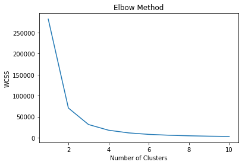
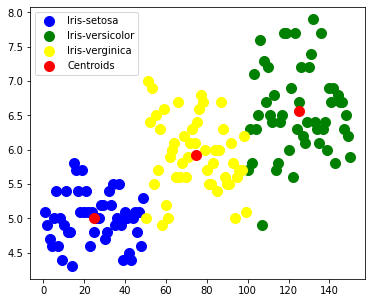

<div align="center">

  <a name="readme-top"></a>
  # Unsupervised Machine Learning
  
  [](LICENSE)
  
  [](https://github.com/Amey-Thakur/TSF-UNSUPERVISED-MACHINE-LEARNING)
  [](https://github.com/Amey-Thakur/TSF-UNSUPERVISED-MACHINE-LEARNING)

  A clustering analysis demonstrating the application of **K-Means Algorithm** to identify optimum clusters in the Iris dataset and visualize the underlying patterns.
  
  **[Google Colab](https://github.com/Amey-Thakur/TSF-UNSUPERVISED-MACHINE-LEARNING/blob/main/Source%20Code/TSF_INTERNSHIP_TASK_2_UNSUPERVISED_LEARNING.ipynb)** &nbsp;·&nbsp; **[Kaggle Notebook](https://www.kaggle.com/ameythakur20/tsf-internship-task-2-unsupervised-learning)** &nbsp;·&nbsp; **[Live Demo](https://amey-thakur.github.io/TSF-UNSUPERVISED-MACHINE-LEARNING/)**

</div>

---

<div align="center">

  [Authors](#authors) &nbsp;·&nbsp; [Overview](#overview) &nbsp;·&nbsp; [Features](#features) &nbsp;·&nbsp; [Structure](#project-structure) &nbsp;·&nbsp; [Results](#results) &nbsp;·&nbsp; [Quick Start](#quick-start) &nbsp;·&nbsp; [Usage Guidelines](#usage-guidelines) &nbsp;·&nbsp; [License](#license) &nbsp;·&nbsp; [About](#about-this-repository) &nbsp;·&nbsp; [Acknowledgments](#acknowledgments)

</div>

---

<!-- AUTHORS -->
<div align="center">

  <a name="authors"></a>
  ## Authors

  | <a href="https://github.com/Amey-Thakur"></a><br>[**Amey Thakur**](https://github.com/Amey-Thakur)<br><br>[](https://orcid.org/0000-0001-5644-1575) | <a href="https://github.com/msatmod"></a><br>[**Mega Satish**](https://github.com/msatmod)<br><br>[](https://orcid.org/0000-0002-1844-9557) |
  | :---: | :---: |

</div>

> [!IMPORTANT]
> ### 🤝🏻 Special Acknowledgement
> *Special thanks to **[Mega Satish](https://github.com/msatmod)** for her meaningful contributions, guidance, and support that helped shape this work.*

---

<!-- OVERVIEW -->
<a name="overview"></a>
## Overview

**Unsupervised Machine Learning - Task 2** is a core Data Science exploration conducted under the **Graduate Rotational Internship Program (GRIP)** at **The Sparks Foundation**. The project focuses on the **Iris Dataset** to predict the optimum number of clusters and represent them visually.

By leveraging the **K-Means Clustering** algorithm, the system iteratively partitions data points into $K$ distinct non-overlapping subgroups (clusters) where each data point belongs to the cluster with the nearest mean.

### Computational Objectives
The analysis is governed by strict **exploratory principles** ensuring cluster validity:
*   **Elbow Method**: Determining the optimal value of $K$ by plotting the Within-Cluster Sum of Squares (WCSS).
*   **Cluster Centroids**: Computing the central vector for each species group.
*   **Dimensionality Visualization**: Plotting the classified clusters in a 2D feature space.

> [!TIP]
> **Algorithm Sensitivity**: K-Means clustering assumes spherical clusters of similar density. Given the slight overlap between *Versicolor* and *Virginica* classes, the algorithm's performance highlights the importance of feature scaling and centroid initialization in density-based separation tasks.

---

<a name="features"></a>
## Features

| Component | Technical Description |
|-----------|-----------------------|
| **Ingestion Pipeline** | Automated data retrieval and parsing using **Pandas** for the Iris dataset. |
| **Optimal K Selection** | Implementation of the **Elbow Method** to minimize WCSS/Inertia. |
| **Model Architecture** | application of `KMeans` from **Scikit-Learn** for centroid initialization and fitting. |
| **Visualization** | Scatter plotting of clusters and centroids using **Matplotlib**. |
| **Cluster Prediction** | Assigning new sample points to the nearest established cluster. |

> [!NOTE]
> ### Empirical Context
> The dataset comprises multivariate floral attributes (Sepal/Petal dimensions). The distinct separation of species in the feature space justifies the use of **K-Means Clustering** to identify inherent groupings without labeled supervision. The **Elbow Method** empirically validates $K=3$ as the optimal cluster count, aligning perfectly with the known biological taxonomy of the Iris species.

### Tech Stack
- **Runtime**: Python 3.x
- **Data Manipulation**: Pandas, NumPy
- **Visualization**: Matplotlib
- **Machine Learning**: Scikit-Learn (sklearn)
- **Environment**: Jupyter Notebook / Google Colab

---

<!-- STRUCTURE -->
<a name="project-structure"></a>
## Project Structure

```python
TSF-UNSUPERVISED-MACHINE-LEARNING/
│
├── docs/                                            # Technical Documentation
│   └── SPECIFICATION.md                             # Architecture & Design Specification
│
├── Mega/                                            # Archival Attribution Assets
│   ├── Filly.jpg                                    # Companion (Filly)
│   ├── Mega.png                                     # Author Profile Image (Mega Satish)
│   └── ...                                          # Additional Attribution Files
│
├── Source Code/                                     # Core Implementation
│   └── TSF_INTERNSHIP_TASK_2_UNSUPERVISED_LEARNING.ipynb  # Jupyter Notebook (Analysis Kernel)
│   └── Iris.csv                                     # Empirical Data Source
│
├── screenshots/                                     # Result Visualization (Empty for setup)
│
├── .gitattributes                                   # Git configuration
├── .gitignore                                       # Repository Filters
├── CITATION.cff                                     # Scholarly Citation Metadata
├── codemeta.json                                    # Machine-Readable Project Metadata
├── LICENSE                                          # MIT License Terms
├── README.md                                        # Project Documentation
└── SECURITY.md                                      # Security Policy
```

---

<!-- RESULTS -->
<a name="results"></a>
## Results

<div align="center">
  <b>1. Optimal K Selection: The Elbow Method</b>
  <br>
  <i>Determining the ideal number of clusters by minimizing WCSS.</i>
  <br><br>
  
  <br><br>
  
  > From the above plot, a clear elbow is seen to be formed at **3**. Thus, the optimum number of clusters is **3**.

  <br><br>

  <b>2. Model Inference: Cluster Visualization</b>
  <br>
  <i>Scatter plot exhibiting the separation of Iris species into 3 distinct clusters: Setosa (Blue), Versicolor (Green), and Virginica (Yellow), with Centroids marked in Red.</i>
  <br><br>
  
</div>

---

<!-- QUICK START -->
<a name="quick-start"></a>
## Quick Start

### 1. Prerequisites
- **Python 3.7+**: Required for runtime execution. [Download Python](https://www.python.org/downloads/)
- **Jupyter Environment**: For interactive code execution (JupyterLab or Notebook).

> [!WARNING]
> **Data Path Integrity**
>
> The analysis kernel relies on relative file paths. Ensure `Iris.csv` remains accessible to the notebook. Modifying the directory structure without updating the ingestion logic will result in `FileNotFoundError` during runtime.

### 2. Installation
Establish the local environment by cloning the repository and installing the computational stack:

```bash
# Clone the repository
git clone https://github.com/Amey-Thakur/TSF-UNSUPERVISED-MACHINE-LEARNING.git
cd TSF-UNSUPERVISED-MACHINE-LEARNING

# Install clustering dependencies
pip install pandas numpy matplotlib seaborn scikit-learn
```

### 3. Execution
Launch the analysis kernel to reproduce the findings:
```bash
jupyter notebook "Source Code/TSF_INTERNSHIP_TASK_2_UNSUPERVISED_LEARNING.ipynb"
```

---

<!-- USAGE GUIDELINES -->
<a name="usage-guidelines"></a>
## Usage Guidelines

This repository is openly shared to support learning and knowledge exchange across the academic community.

**For Students**  
Use this project as reference material for understanding **unsupervised learning pipelines**, **K-Means clustering**, and **optimum cluster prediction**. The source code is available for study to facilitate self-paced learning and exploration of **Hyperparameter tuning (Elbow Method)**.

**For Educators**  
This project may serve as a practical lab example or supplementary teaching resource for **Data Science** and **Applied Statistics** courses. Attribution is appreciated when utilizing content.

**For Researchers**  
The documentation and architectural approach may provide insights into **academic project structuring**, **predictive inference**, and **industrial internship artifacts**.

---
<!-- LICENSE -->
<a name="license"></a>
## License

This academic submission, developed for the **Graduate Rotational Internship Program (GRIP)** at **The Sparks Foundation**, is made available under the **MIT License**. See the [LICENSE](LICENSE) file for complete terms.

> [!NOTE]
> **Summary**: You are free to share and adapt this content for any purpose, even commercially, as long as you provide appropriate attribution to the original authors.

Copyright © 2021 Amey Thakur & Mega Satish

---

<!-- ABOUT -->
<a name="about-this-repository"></a>
## About This Repository

**Created & Maintained by**: [Amey Thakur](https://github.com/Amey-Thakur) & [Mega Satish](https://github.com/msatmod)<br>
**Role**: Data Science & Business Analytics Interns  
**Program**: Graduate Rotational Internship Program (GRIP)  
**Organization**: [The Sparks Foundation](https://www.thesparksfoundationsingapore.org/)

This project features **Unsupervised Machine Learning - Task 2**, a clustering analytics study conducted as part of the **GRIP Internship**. It explores the application of K-Means to solve grouping problems.

**Connect:** [GitHub](https://github.com/Amey-Thakur) &nbsp;·&nbsp; [LinkedIn](https://www.linkedin.com/in/amey-thakur) &nbsp;·&nbsp; [ORCID](https://orcid.org/0000-0001-5644-1575)

### Acknowledgments

Grateful acknowledgment to [**Mega Satish**](https://github.com/msatmod) for her exceptional collaboration and scholarly partnership during the execution of this data science internship task. Her analytical precision, deep understanding of clustering algorithms, and constant support were instrumental in refining the models used in this study. Working alongside her was a transformative experience; her thoughtful approach to problem-solving and steady encouragement turned complex analytical challenges into meaningful learning moments. This work reflects the growth and insights gained from our side-by-side academic journey. Thank you, Mega, for everything you shared and taught along the way.

Special thanks to the **mentors at The Sparks Foundation** for providing this platform for rapid skill development and industrial exposure.

---

<div align="center">

  [↑ Back to Top](#readme-top)

  [Authors](#authors) &nbsp;·&nbsp; [Overview](#overview) &nbsp;·&nbsp; [Features](#features) &nbsp;·&nbsp; [Structure](#project-structure) &nbsp;·&nbsp; [Results](#results) &nbsp;·&nbsp; [Quick Start](#quick-start) &nbsp;·&nbsp; [License](#license) &nbsp;·&nbsp; [About](#about-this-repository) &nbsp;·&nbsp; [Acknowledgments](#acknowledgments)

  <br>
  📈 **[TSF-UNSUPERVISED-MACHINE-LEARNING](https://amey-thakur.github.io/TSF-UNSUPERVISED-MACHINE-LEARNING/)**

  ---

  ### Presented as part of the Internship @ The Sparks Foundation

  ---

  ### 🎓 [Computer Engineering Repository](https://github.com/Amey-Thakur/COMPUTER-ENGINEERING)

  **Computer Engineering (B.E.) - University of Mumbai**

  *Semester-wise curriculum, laboratories, projects, and academic notes.*

</div>


