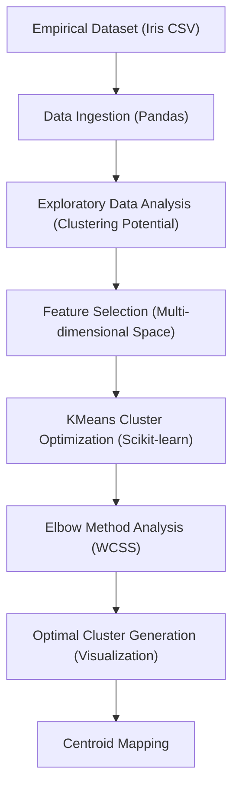

# Technical Specification: Unsupervised Machine Learning

## Architectural Overview

**The Sparks Foundation - Unsupervised Machine Learning** is a cluster analysis study designed to determine the optimal categorical partitioning of the 'Iris' dataset. The project serves as a digital exploration into centroid-based clustering heuristics, established during a Data Science and Business Analytics internship program.

### Data Science Pipeline

---

## Technical Implementations

### 1. Modeling Architecture
-   **Core**: Built on **Scikit-learn**, specifically utilizing the `KMeans` algorithm for iterative centroid minimization.
-   **Estimation Logic**: Implementing the "Elbow Method" to determine the optimal $K$ value by minimizing Within-Cluster Sum of Squares (WCSS).

### 2. Evaluation & Validation
-   **Metrics**: Utilizes variance-based minimization to quantify intra-cluster cohesion.
-   **Visualization**: Employs multi-dimensional scatter plotting with centroid overlays to illustrate empirical group partitioning.
-   **Heuristics**: Scalable clustering logic capable of processing standardized botanical observations.

### 3. Developmental Infrastructure
-   **Notebook Runtime**: The primary research was conducted in **Google Colab**, leveraging hosted resources for exploratory clustering analysis.
-   **Source Production**: The analytical kernel is cross-compiled into a standalone **Python Script** for production-ready execution and scholarly reference.

---

## Technical Prerequisites

-   **Runtime**: Python 3.7+ environment (Local or Cloud-based).
-   **Dependencies**: `pandas`, `numpy`, `matplotlib`, and `scikit-learn` libraries.

---

*Technical Specification | Data Science | Version 1.0*
